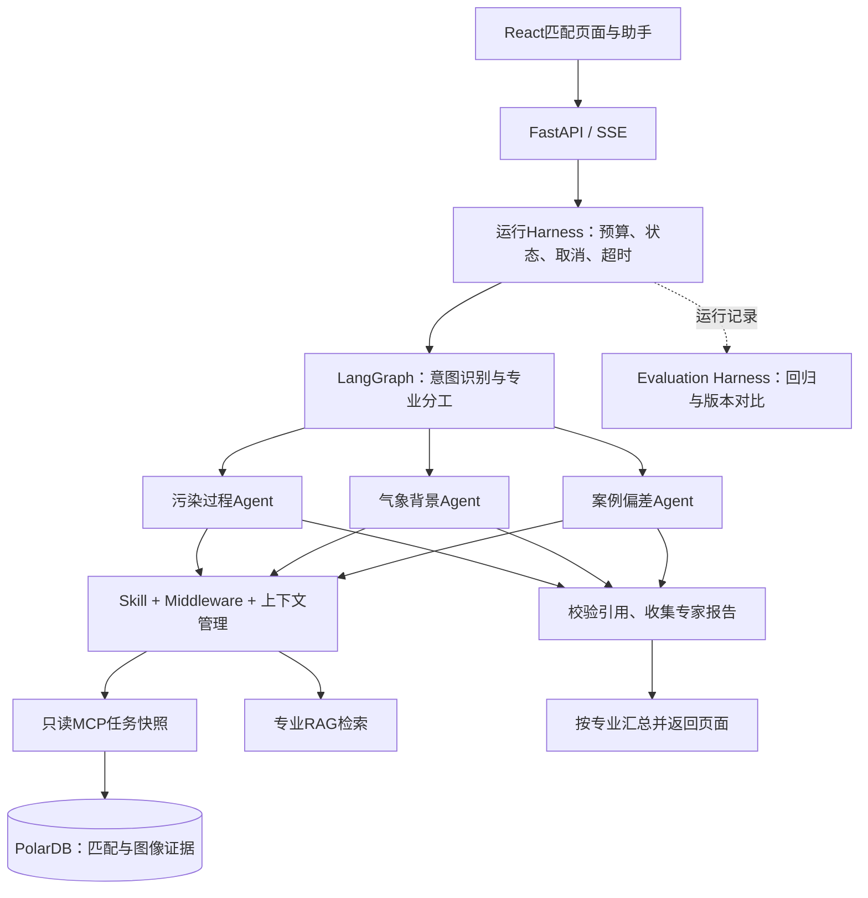

# 空气质量预报智能体与相似过程匹配平台

把当前污染预测放进历史案例库中比较，寻找最相似的 **Top3 污染过程**，再由污染、气象和案例偏差三个专业智能体解释依据。面向预报员提供参考，不自动修改正式预报。

## 页面怎么用

1. 选择预测批次和连续1—7天，开始相似度匹配。
2. 查看Top3得分、逐日变化、当前与历史四类气象图；图片可放大并在新窗口查看。
3. 在页面下方「空气质量预报助手」提问，也可从五类示例开始。
4. 查看各专家的分析进度、结论和证据；支持停止分析、刷新页面后恢复结果。

五类问题：**污染风险、时空演变、成因分析、历史案例与偏差、专业知识**。九宫格不是行政区，没有行政区映射时不生成对应区域结论。

## 两条流程

**算法负责匹配与排序：**

```text
同批次1—7天预测 → 完整性检查与九宫格特征
→ 联合粗筛Top50 → 数值精排Top10 → Qwen多模态图像复核
→ 程序合分 → 正式Top3 → 历史残差与图片证据
```

使用NumPy、滑动窗口、标准化差值、加权距离及逐日过程标签；Matplotlib渲染温度、湿度、气压/风、500 hPa环流。综合分固定为 **污染物60%＋气象数值20%＋图像20%**。有效图像复核不足3个，不生成正式Top3；相似分数不是命中率。当前数值规则版本为`LABEL_RETRIEVAL_V2.2_PAST_BASELINE`：历史库无固定年份下限；新任务的标准差及变化阈值只使用当前窗口/任务日期之前的数据，已保存历史任务不重算。

**智能体负责取证与解释：**



简单问题只调用一个专家，复合问题最多三个。专家使用受限ReAct：选择工具→观察结果→继续或结束。使用严格JSON动作协议，不依赖供应商原生tool_calls；不执行任意SQL/代码。

## 技术分别做什么

| 技术 | 本项目实现 |
|---|---|
| LangGraph / Multi-Agent | 5节点主图，3个专业子图各5节点；主工作流不另算Agent |
| Agent Teams Harness | 统一运行状态、3路模型并发、共享预算、超时、取消、部分失败与模型输出轨迹 |
| Middleware Chain | 工具白名单、固定任务范围、参数校验、重复调用拦截与调用记录 |
| Context Engineering | 同任务最近3个问题、专家独立证据、字符预算、超限资料标记；旧回答不当真值 |
| Skill System | 3份白名单专业规则，记录版本与内容哈希 |
| MCP | 7个只读工具；一次快照固定任务版本，专家从快照按需取证 |
| RAG | 文本分块、发布状态过滤、关键词/向量召回、RRF融合、可配置Reranker和来源引用 |
| Evaluation Harness | 固定10题，比较路由、引用、预算和终态；另有异常及算法回归测试 |
| FastAPI / SSE | 创建/查询/取消分析；事件先落盘，再推送，支持Last-Event-ID重放 |
| PolarDB / SQLite | 业务数据与PNG在PolarDB；单进程Agent运行日志在本地SQLite，Docker挂持久卷 |
| Prefect / Docker | 增量调度适配器及容器编排；正式中台契约就绪后补真实入库映射 |

运行Harness和评测Harness是两套职责：前者管运行，后者检查改版是否退化。专家报告程序化汇总，避免再用一轮模型改写排名；引用ID检查不等于已经证明所有自然语言结论正确，专业语义仍需专家评测。

## 项目目录

```text
frontend/src/                React匹配页面、Top3图片、AgentPanel
backend/
  matching.py               污染物与气象检索计算
  weather.py / model_review.py  NC读取、四图渲染、多模态复核
  circulation.py            可配置环流规则分类与特征提取
  service.py / main.py       匹配任务与HTTP接口
  agent/
    team_graph.py           新版主图和专业ReAct子图
    harness.py / store.py    运行生命周期、持久事件与恢复状态
    middleware.py / context.py  权限、预算、上下文
    model_client.py         可配置Qwen兼容接口与结构化响应
    knowledge.py / ingest_knowledge.py  RAG检索与资料导入
    graph.py / runtime.py   原单分支工作流兼容入口
  knowledge_schema.sql     知识表与pgvector建表脚本
mcp_server/                 只读证据服务
skills/                     三份专业Skill及评测样例
evals/                      固定问题集、回放模型与评测运行器
tests/                      算法、接口、Agent、RAG和中台适配测试
workflows/                  Prefect增量接入骨架
docs/                       业务架构、升级方案与面试说明
```

## 本地启动

需要Python 3.11+、Node.js 20+、已有业务数据库与气象NC文件。在项目根目录将 `.env.example` 复制为 `.env`，填写连接与模型配置，密钥不会提交Git。

```powershell
python -m pip install -r requirements.txt
cd frontend
npm ci
npm run build
cd ..
```

两个终端分别启动：

```powershell
python -m mcp_server.server
python -m uvicorn backend.main:app --host 127.0.0.1 --port 8000
```

页面：<http://127.0.0.1:8000>；接口文档：<http://127.0.0.1:8000/docs>。本地 `MCP_SERVER_URL` 应为 `http://127.0.0.1:8010/mcp`，Compose会自动改为容器服务名。

| 配置 | 默认/说明 |
|---|---|
| MODEL_NAME | `qwen3.8-max`，用于图像复核；可替换为已开通的视觉模型 |
| AGENT_MODEL_NAME | 文本分析模型，可独立配置；曾配置的`qwen3.8-32b`被当前服务返回404 |
| AGENT_MAX_ROUNDS | 每专家最多4轮动作 |
| AGENT_MAX_TOOL_CALLS / AGENT_MAX_MODEL_CALLS | 每次分析最多12/16次调用，包含初始快照和意图识别 |
| AGENT_TIMEOUT_SECONDS | 已有任务问答90秒；首次匹配另由原任务服务管理 |
| AGENT_CONTEXT_CHARACTERS | 24000字符的证据上下文预算，非精确token计量 |
| AGENT_STORE_PATH | `.runtime/agent.sqlite3`；包含提问和业务证据，应留在业务服务器 |
| KNOWLEDGE_ENABLED / KNOWLEDGE_USE_VECTORS | 默认false；资料和数据库准备后分别启用 |
| EMBEDDING_MODEL / EMBEDDING_DIMENSIONS | 向量模型和维度；检索与入库必须一致 |
| RERANKER_MODEL / RERANKER_URL | 可选；接口契约见下节 |

模型输出日志保留输出正文、哈希、token用量及校验拒绝事件，不保存认证头或内部思维链。

默认单API进程部署，不支持多个worker同时管理运行日志。服务重启将未完成分析标为中断，允许重新发起；不会假装自动续跑。当前没有多租户账号权限系统，仅用于受控本机/内网演示。

## RAG资料接入

先在目标schema执行 `backend/knowledge_schema.sql`，需要数据库允许pgvector扩展。开启向量前核实Embedding维度；当前没有预建向量索引，小知识库使用精确检索，规模增长后再按维度建索引。

```powershell
python -m backend.agent.ingest_knowledge 专业资料.md --domain meteorology --title 气象资料 --version v1 --source-uri internal:weather --publish
```

导入支持UTF-8 Markdown/TXT，使用LangChain `RecursiveCharacterTextSplitter`（900字符、120重叠）。不加`--publish`保存为草稿，检索仅使用已发布资料。分块保留标题、版本、来源及片段编号，不伪造PDF页码。

关键词召回为中文二元词/英文词匹配；启用向量时与余弦近邻通过RRF融合。可选Reranker采用 `{model,query,documents,top_n}` 请求和 `results[{index,relevance_score}]` 响应契约，需要兼容服务，不能直接假定所有供应商地址通用。检索返回来源，生成回答绑定证据ID。

专业资料尚未交付，因此没有导入假知识，也没有重新验证“RAG正确率91%”。

## 接口与图片存储

| 接口 | 用途 |
|---|---|
| `POST /api/tasks`、`GET /api/tasks/{task_id}` | 创建和查询相似匹配 |
| `POST /api/agent/runs` | 提交question、可选task_id/conversation_id，返回run_id |
| `GET /api/agent/runs/{run_id}` | 查询状态和专家报告 |
| `GET /api/agent/runs/{run_id}/events` | SSE进度与结果；支持Last-Event-ID或after参数 |
| `POST /api/agent/runs/{run_id}/cancel` | 幂等取消，不影响匹配任务 |
| `POST /api/agent/stream` | 旧单分支接口，保留兼容 |
| `GET /api/images/{image_hash}` | 返回PNG原图 |

图片缓存严格匹配完整日期列表，复核前再次校验日期和图层，避免短窗口复用长窗口图片。图片由Matplotlib输出PNG二进制，存入`match_image.image_bytes`（bytea）；SHA-256用于标识和去重，任务保存哈希引用。URL是读取入口，哈希不能还原图片。模型复核响应与分数另行保存。

## Docker与测试

```powershell
docker compose up --build
python -m unittest discover -s tests -v
python -m evals.run --output .runtime/evaluation.json
# 可选：真实数据库事务回滚测试，不留下测试表或扩展
$env:RUN_DATABASE_INTEGRATION="1"
python -m unittest discover -s tests -p test_database_integration.py -v
```

Docker页面：<http://127.0.0.1:8080>。数据库地址必须容器可达；Docker Desktop默认`DOCKER_PGHOST=host.docker.internal`；其他部署设置DOCKER_PGHOST为实际数据库地址。增量调度和监控可通过 `--profile platform --profile monitoring` 启动。

评测默认mock，不调用付费模型。`--mode live --task-id 实际UUID`测试真实模型与MCP；`--baseline 路径`比较同模式、同问题集结果。回归通过率不是专业准确率；Top3命中率93%和RAG正确率91%属于用户提供的业务专家抽样口径，仓库未附原始评测集。

## 本次验证（2026-09-23）

- 52项自动测试通过，含真实数据库事务回滚下的pgvector检索、缺失残差与业务引用隔离；10题离线工程评测通过。
- Docker三服务启动成功；真实Qwen三专家均返回带引用报告，缺失资料明确说明。
- 一天窗口完整匹配成功：10个候选图像复核全部通过；当前＋Top3的16个图像引用、PNG内容哈希与日期逐一核验通过。
- 页面完成选日期、发起匹配、取消分析和刷新恢复验证。以上不是93%/91%业务指标的重新测评。

## 当前边界

- 当前匹配仍为2025固定数据联调，气象为合成日均场，不是生产气象验证或无未来泄漏回测。
- 环流空间图参与多模态复核；新增可配置环流规则引擎（backend/circulation.py），提取上海附近地面气压、风和500 hPa特征；经审核规则由CIRCULATION_RULES_PATH加载。未配置时明确返回not_configured，规则结果不擅自改变综合权重。
- 正式数据中台接口、历史回灌、行政区映射及审核知识资料仍是外部依赖；Prefect默认mock，不写入猜测的数据。
- Agent日志暂用SQLite以便单机持久运行，业务数据仍在PolarDB；跨进程恢复和数据库运行队列是后续部署扩展。

详细背景见[升级方案](docs/智能体技术升级与Harness开发方案.md)、[通俗讲解](docs/智能体技术升级与Harness开发方案_通俗讲解版.md)和[业务术语](CONTEXT.md)。旧方案中的“现状”是当时核查记录；当前实现以本README及代码为准。
