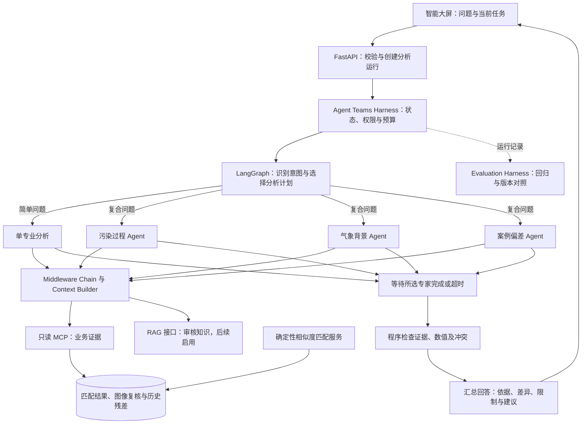

# 相似度匹配智能体技术升级与 Harness 开发方案

> 2026-09-22 实施更新：本文保留最初方案和当时基线。多专家受限ReAct、运行Harness、上下文隔离、SSE持久事件、RAG可配置检索和评测运行器现已实现；运行日志采用单机SQLite，业务与图像数据仍在PolarDB。实际启用范围、外部资料依赖及运行命令以根目录README和当前源码为准。

> 编制日期：2026-09-20。范围：Multi-Agent、受限 ReAct、Agent Teams Harness、Middleware Chain、Context Engineering、Evaluation Harness，并完善现有 Skill、MCP、LangGraph 与 RAG 接口。
> 本文是待实施方案，不代表这些能力已经完成。本次仅交付此 Markdown；不修改业务代码、数据库或 GitHub Issues。

## 1. 结论与建设目标

这些技术可以接入现有项目。建议围绕一个真实问题建设：**“明天上海哪些区域有污染风险，天气原因是什么，Top3 历史案例能提供什么偏差参考？”** 当前问答一次只进入一个领域子图，难以完整处理这种跨领域问题。

采用两条相互配合的链路：

- **匹配计算链路**：程序完成窗口筛选、数值计算、图像复核校验和最终排序，保证结果可验证。
- **智能体分析链路**：按问题选择专业 Agent，受限调用工具，汇总证据、解释差异和提供参考。简单查询走单分支，复合问题才并行会商。

核心指标是业务回答是否有证据、是否完整、是否保持既有匹配正确性。节点数和技术名词数量不作为建设目标。系统仅供预报员参考，不自动写回正式预报。

## 2. 仓库核查与现状

### 2.1 核查基线

| 项目 | 核查结果 |
|---|---|
| GitHub 仓库 | https://github.com/xk309/xiangsi_agent.git |
| 对应本地 Git 根目录 | `D:\Project\xiangsi_agent\start\demo`；不是外层 `D:\Project\xiangsi_agent` |
| 远端 HEAD 与本地 HEAD | 均为 `25bc3f4d21dd8ce36df0605be720ec12edd487f6`，提交说明为当前窗口与 Top3 图片并排展示 |
| 工作区差异 | `backend/agent/`、`mcp_server/`、`skills/`及部分测试、架构文档为本地未跟踪文件；配置、README 等有未提交修改 |
| 本文证据范围 | 远端 HEAD 只读核对、本地提交及当前工作区源码审查；没有运行真实模型、数据库写入或业务效果评测 |

因此，下文“现有”包含本地原型，不等于 GitHub 提交或生产系统已经具备。开发前先审查并保存现有工作区，单独形成可追溯基线，不覆盖未提交工作。

### 2.2 能力与缺口

| 模块 | 当前代码事实 | 本次升级方向 |
|---|---|---|
| 匹配算法 | 确定性检索、图像校验、分项合分及正式排名 | 保持算法边界，暴露可引用的结果和残差 |
| LangGraph | 主图意图路由；三个子图各为 `gather → analyze`，每轮只选一个领域 | 保留单领域路径，新增受控并行分析与汇总 |
| Multi-Agent | 现有子图不是自主协作团队 | 专家分别具备任务、状态、工具范围、停止条件与结构化报告 |
| ReAct | 模型客户端发送文本请求，程序预先决定工具调用 | 新增模型选择工具、执行观察、再次决策的有界循环 |
| Skill | 三个白名单专业规则文件，有版本和样例 | 绑定工具白名单、输出契约、适用场景及回归集 |
| MCP | 六个只读工具；只返回已有任务数据；部分细节未接入主图 | 补区域、时序、残差证据；校验工具状态及候选归属 |
| 气象问答 | 图片工具只返回哈希；问答模型不接收图片 | 优先读取已校验图像复核证据；必要时使用明确的多模态通道 |
| Context Engineering | 规则、当前问题与证据直接拼接，未见预算化选择和对话历史管理 | 按领域、任务、时间和上下文预算选择证据 |
| Harness | 已有图运行器、Checkpoint及部分异常处理 | 统一团队调度、预算、取消、错误分类、事件和版本记录 |
| Evaluation Harness | 有算法/API/路由测试及 Skill 样例；路由测试使用替身模型 | 增加统一数据集、执行器、评测器、版本对比及发布门槛 |
| RAG | `KnowledgeRepository.search`返回 `not_configured` | 保留骨架，专业资料到位后再接真实分块、检索及引用评测 |

现有五类问题“能被路由”，不等于证据已经齐全。例如，区域污染风险不能只依据任务 Top3 摘要回答；九宫格也不等于上海行政区。

## 3. 概念如何落实到业务

| 概念 | 通俗解释 | 在本项目中新增什么 | 何时不启用 |
|---|---|---|---|
| Multi-Agent | 不同专业分别分析，同一份结果统一汇总 | 污染过程、气象背景、案例偏差三个专家，知识专家后续接入 | 查任务进度、看单个候选无需会商 |
| ReAct | 模型决定查什么，观察结果后决定下一步 | 查摘要→查候选细项→查残差或天气复核→生成有引用结论 | 数值距离、权重合分、正式排名不交给循环自由决定 |
| Agent Teams Harness | 管理一组 Agent 怎样运行的执行底座 | 并发调度、共享预算、权限、超时、失败隔离、状态和轨迹 | 首版不支持无限递归派生 Agent |
| Middleware Chain | 调用前后按顺序执行公共处理 | 校验范围→检查预算→准备上下文→调用→校验响应→记录轨迹 | 不为每个业务函数重复造一套中间件 |
| Context Engineering | 把恰当的证据放进模型上下文 | 选择、隔离、压缩和引用证据；保留时间及版本边界 | 不把亿级原始网格或整库案例直接塞入模型 |
| Evaluation Harness | 用同一组题重复比较不同版本 | 算法回归、工具轨迹评测、引用核对、专家复核及耗时成本对照 | 不用平均相似度分数上涨证明质量提升 |

这些是架构模式，不要求同时引入多套 Agent 框架。优先基于现有 LangGraph、FastAPI、MCP SDK 和 PostgreSQL 接口实现；模型及 SDK 版本先做兼容验证，再锁定依赖。

## 4. 推荐目标架构

图中的组件不全部等于 LangGraph 注册节点。推荐主流程节点为 `validate_request`、`recognize_intent`、`build_analysis_plan`、`run_specialists`、`validate_findings`、`compose_answer`、`finalize_run`，另设 `request_clarification` 分支。具体注册数量以开发结果为准。

每个专家可以使用 `prepare_context → decide_next_action → execute_tool → observe_result` 循环，最后 `write_report`。`decide_next_action`选择 `call_tool`、`finish`或`need_clarification`；工具集合和循环预算由程序限制。

### 4.1 专家职责与输入输出

| 专家 | 输入 | 可取证据 | 输出 |
|---|---|---|---|
| Pollution Agent | 当前任务、区域、污染物、窗口 | 合规聚合的站点/区域预测、逐日标签、峰值和持续性 | 污染水平、发生时间、区域差异及证据引用 |
| Meteorology Agent | 同批次同窗口、关联历史候选 | 气象数值、已校验多模态复核；后续审核知识 | 扩散/输送条件解释、天气结构差异；证据不足时不下归因定论 |
| Analogue & Bias Agent | 当前任务及正式 Top3 | 分项得分、排名、具备可比口径的历史残差 | 相似原因、差异、历史误差和参考限制 |
| Knowledge Agent（后续） | 专业问题、领域、资料版本 | 已发布知识片段 | 带资料定位的回答，不把一般知识当成本次污染事实 |

返回统一 `SpecialistReport`：`specialist_name`、`status`、`findings`、`evidence_ids`、`missing_evidence`、`limitations`、`usage`。其中 `status`限定 `completed / partial / failed`；结论绑定引用，不返回完整内部思维链。

### 4.2 并行状态与冲突

- 一轮只读分析固定匹配结果版本；任务尚未完成时明确返回进度或部分结果，不能把不同时间的候选排名拼在一起。
- 专家各自写报告，不同时覆盖共享 `answer`或 `evidence`。首版可在 `run_specialists`中用受限异步并发收集报告，再由主图一次写入；若改用 LangGraph 并行分发，必须定义按专家名、证据 ID 去重的 reducer。
- 汇总等待已选择专家的终态，超时专家标记缺失，不能无限等待或伪装全部成功。
- 冲突先核对来源、时间、空间口径和版本。算法分数以程序结果为准；气象解释存在分歧时保留分歧及不足，不用投票修改排名。

## 5. 受限 ReAct 与模型协议

示例：“Top1 为什么更相似，明天 PM2.5 是否需要调低？”

1. 获取当前任务，确认存在正式结果及输入窗口。
2. 获取 Top1 与必要对照候选的数值分项。
3. 获取已校验气象图像复核及历史残差。
4. 缺少历史预测、同类时效或模型可比性时，停止定量订正，只说明缺少什么。
5. 输出结论、简短依据、引用与限制，最终预报由预报员决定。

当前 `AgentModelClient`没有解析模型 `tool_calls`的能力，需要新增 `decide_action`适配。优先验证供应商原生工具调用，保持 `tool_call_id`与工具返回对应；若所选模型不支持，使用严格 JSON 动作协议加 Pydantic 校验。协议包含 `action_type`、`tool_name`、`arguments`，不接受任意 Python、SQL 或网址。原生和 JSON 两种模式使用同一套权限校验与停止规则，不把普通文本当工具指令执行。

模型名称可配置，按会话约定保留 `qwen3.8-32b`配置意图，但名称有效性、文本工具调用及视觉能力必须分别实测，不由名称推断。文本和视觉模型配置可分离。

### 5.1 建议初始预算（待压测，不是现有能力）

| 控制项 | 建议默认值 | 处理方式 |
|---|---|---|
| 专家最大并发 | 3 | 全局模型并发信号量另行限制，避免多用户叠加耗尽配额 |
| 每专家动作轮数 | 4 | 超限生成部分报告，主图仍可总结 |
| 单次分析工具调用总数 | 12 | 并发共享计数，调用前原子预占；重试也计数 |
| 单次分析模型请求总数 | 16 | 意图、各专家、修复和汇总都计入 |
| 整次分析期限 | 90秒 | 只用于已有任务的问答；首次匹配及图像复核另有任务期限 |
| 工具调用期限 | 10秒起步 | 随接口实测调整；异步等待超时不等于底层SQL停止 |
| 瞬时失败重试 | 最多1次 | 仅幂等只读调用；参数错误、权限错误不盲重试 |
| 重复调用检测 | 相同工具、参数、结果版本 | 命中后复用观察；无新增证据则停止 |

同时限制 token、图片数量和图片大小；额度依据部署模型实测配置。工具重试不绕过总期限，模型输出修复最多1次且计入预算。

## 6. Agent Teams Harness 与中间件

### 6.1 运行 Harness 的责任

`AgentRunManager`负责运行生命周期：`queued → running → completed / partial / failed / cancelled / timed_out`。跟踪唯一 `run_id`、会话、匹配任务、分析计划、预算和专家状态。

必须区分三种 ID：`task_id`指相似度匹配任务，`conversation_id`指对话，`run_id`指一次分析。更换当前任务时重建任务证据上下文，防止旧任务结果串入新回答。

Checkpoint保存的是图状态。真正恢复还需要：保存运行输入及版本、定位检查点、重新调度、恢复预算，并避免重复提交副作用。本期不承诺仅配置 Checkpoint 就能在进程重启后自动续跑。第一阶段重启后标记中断、允许显式重试；后续独立验证持久化 Worker 和恢复机制。

### 6.2 Middleware Chain 调用顺序

| 顺序 | 中间件 | 输入与职责 |
|---|---|---|
| 1 | Request Scope | 校验用户可访问的任务/候选、请求ID和时间范围；只读不等于无需鉴权 |
| 2 | Budget & Deadline | 检查并预占调用额度、并发名额和剩余时限 |
| 3 | Context Builder | 注入对应Skill、选择证据、隔离任务，控制长度 |
| 4 | Model / Tool Adapter | 执行模型或白名单工具；保留原生工具调用关联ID |
| 5 | Result Validation | 解析协议、检查MCP `isError`与业务状态，验证数值及来源；错误不能伪装成有效证据 |
| 6 | Trace & Usage | 写脱敏事件、耗时、调用次数、缓存状态、版本与错误类别 |

实现为显式 `before_call / after_call / on_error`接口或包装器。框架内置中间件是否采用，以锁定的 LangChain/LangGraph 版本 API 为准；不能假定现有 LangGraph 依赖自动带来全部 Middleware 功能。

取消要传递给运行中的网络请求；数据库操作设置语句超时。当前同步SQL经线程执行时，取消协程不保证线程查询立即结束，应记录为“取消已请求”，待执行结束后不再投递结果。服务器工作任务与浏览器连接解耦，页面关闭不直接丢失运行记录。

## 7. Context Engineering 与 Skill

| 策略 | 开发内容 | 业务例子 |
|---|---|---|
| Select：选择 | 根据意图选当前任务、必要候选、变量和证据 | 问Top1原因不加载全部Top50原始矩阵 |
| Isolate：隔离 | 专家只接收本领域数据；身份、批次与版本贯穿 | 气象专家不会把别的任务风场拿来解释今天 |
| Compress：压缩 | 数组先由程序统计；长文本摘要保留来源和限制 | 保留峰值日、持续天数、分项分数，不随意压缩关键数值 |
| Persist：持久化 | 原图、结构化证据和完整报告留库，模型只取引用 | 模型上下文压缩后仍能查看原始图与来源 |
| Refresh：更新 | 多轮问题重新核对当前任务和数据版本 | “再看浦东”先确认区域映射与当前批次 |

建议证据对象 `EvidenceItem`包含 `evidence_id`、`source_type`、`task_id`、`source_version`、`forecast_start_time`、`valid_time_range`、`spatial_scope`、`payload`、`limitations`。网页或知识文档的文字属于资料，不得覆盖系统规则或扩大工具权限。

采用优先级装配：业务约束与Skill → 当前问题 → 必需证据 → 可选证据 → 对话摘要；装配前预留回答 token。超限先去重复、再删低相关材料，保留数值单位、日期和缺测标记。对话摘要不能替代业务数据真值。

现有三个Skill继续复用，增加明确输出字段和适用工具映射。Skill版本、文件内容哈希、模型参数和数据版本均进入运行记录。规则版本变化触发对应回归集；不能只改提示词抬高分数而宣称准确率改善。

## 8. MCP、五类问题与 RAG 接入

### 8.1 先补业务证据

| 问题类别 | 所需证据 | 工具改动（以下新增名均为拟定） |
|---|---|---|
| 污染风险 | 区域/站点预测、污染物、时间和业务阈值 | `get_pollution_summary`；需先确认行政区与站点映射，不能以九宫格冒充行政区 |
| 时空演变 | 峰值时间、持续性、逐日或小时序列 | `get_pollution_timeline`；只有日数据时不生成小时级结论 |
| 成因分析 | 当前气象数值和已校验复核、必要知识 | 接入已有 `similarity_get_review_evidence`并新增 `get_weather_summary` |
| 历史案例与偏差 | 正式排名、分项、匹配历史预测/实况残差 | 复用候选工具，新增 `get_historical_residuals` |
| 专业知识 | 经审核且已发布的专业资料 | 完善 `KnowledgeRepository.search`；资料未到时明确不可用 |

上述工具放在现有 `mcp_server/tools.py`和注册层，统一分页、单位、状态、时间和版本。新增工具只读，不开放任意SQL。前端显式创建匹配任务仍经原任务接口；Agent返回操作建议和入口，首期不让自由循环创建昂贵匹配任务。

接入气象证据时按任务中的候选与 `review_cache_key`校验归属。图片哈希不能代替图像内容。优先复用已经校验的视觉结果，避免重复昂贵看图；确需新视觉分析时使用单独受限接口并记录模型能力与成本。

现有 `get_task_result`即使没有正式名次，也可能把前三个中间候选放进 `top3`字段。新证据适配器必须同时检查任务完成状态、有效复核及 `final_rank`，必要时改用 `provisional_candidates`表达临时结果；不能仅根据字段名宣称正式Top3。

### 8.2 RAG 后续边界

资料到位后建设：审核发布 → 章节解析 → `RecursiveCharacterTextSplitter`等切分器 → Embedding → 领域/版本过滤 → 向量与关键词召回 → Reranker → 带引用生成。

切分保留文档、章节、版本、页码和适用范围；`chunk_size`、`chunk_overlap`按真实中文资料评测确定。PolarDB扩展可用性、向量维度、索引能力、Embedding/Reranker模型另行验证。未导入资料前只验收“缺知识时正确说明”的行为，不宣称完成真实RAG。用户提供的91%业务评测须附来源和口径，不能用作本地骨架的验收结果。

## 9. API、存储与前端

### 9.1 拟新增契约

| 接口 | 用途 | 核心字段 |
|---|---|---|
| `POST /api/agent/runs` | 创建一次分析，返回202 | 请求：question、task_id、conversation_id；响应：run_id、status、events_url |
| `GET /api/agent/runs/{run_id}` | 查询报告和状态 | 专家状态、最终回答、引用、限制与错误类别 |
| `GET /api/agent/runs/{run_id}/events` | SSE事件 | 有序event_id、run_id、事件类型、时间、业务内容 |
| `POST /api/agent/runs/{run_id}/cancel` | 请求取消 | 返回当前取消状态；重复请求幂等 |

保留原 `POST /api/agent/stream`兼容入口，内部适配新运行层；迁移期不破坏现有前端事件消费者。创建运行采用客户端请求ID加调用者范围实现幂等，取消不影响已经完成的匹配任务。

事件类型建议：`run_started`、`specialist_started`、`tool_completed`、`specialist_completed`、`answer`、`run_finished`、`run_error`。终态事件只发一次；支持按事件ID重放才可宣称断线续接。数据库事件先落地再推送，客户端按ID去重；事件过期返回状态快照。

前端展示“正在分析污染过程/天气条件/历史偏差”、当前与Top3图、证据入口、缺失材料和取消按钮。前台无需展示 token 预算或中间件名称。多Agent部分失败时展示已完成结论及缺失项。

### 9.2 拟新增扩展表

| 表 | 内容 |
|---|---|
| `agent_run` | 运行ID、会话、用户范围、任务、输入快照、版本、预算、状态、时间、最终报告 |
| `agent_run_event` | 运行ID和递增序号联合唯一；事件类型、专家、引用及脱敏payload |
| `agent_tool_call` | 工具名、参数哈希、来源版本、尝试次数、结果引用、错误与耗时 |
| `evaluation_run` / `evaluation_case_result` | 数据集版本、代码版本、配置、单例结果、评分与报告引用 |

通过独立版本迁移新增扩展表，不重建基础八表；Checkpoint内部表按其组件版本管理。原PNG继续使用 `match_image`的 `bytea`存储与SHA-256去重，运行记录保存引用。大数据、原图和重复工具结果不复制到每条SSE事件。制定日志保留周期、备份和归档规则，字段中不保存密钥或认证头。

## 10. Evaluation Harness：如何证明升级有效

### 10.1 三层验证

| 层次 | 输入及方式 | 能证明什么 |
|---|---|---|
| 确定性回归 | V2.1独立算例、固定数据、边界样本 | 数值、排名和失败条件正确；不依赖模型随机性 |
| Agent离线回归 | 固定工具返回、模拟模型动作、故障注入 | 工具白名单、预算、状态合并、错误处理和事件协议正确 |
| 真实模型与专家评测 | 冻结问题集、同一数据版本、真实模型、专家标注 | 工具选择、回答正确性、证据支持及成本是否改善 |

测试样例存在不等于执行过模型评测。Harness在报告中区分 `mock`、`recorded`、`live`模式；离线回放不能宣称真实接口稳定或实时延迟。

### 10.2 数据集与指标

每个用例记录：`case_id`、业务类别、问题、输入快照引用、必要证据、可接受工具/约束、禁止行为、期望事实、专家标签及评测规则。不同正确工具路径都可通过，不把完全相同的调用顺序作为所有题目的硬要求。

- 匹配：Hit@3、NDCG@3、分项偏差；按独立污染事件/时间分割，避免相邻重叠窗口泄漏。93%只有在抽样数量、专家规则和原始计数可追溯时才作为基线。
- 问答：五类问题分别统计任务完成率、事实正确率、引用支持率、无依据结论比例、缺证正确处理率。
- Harness：越权拦截、预算遵守、重复调用中止、并行报告完整、取消与终态一致性。
- 工程：P50/P95耗时、模型调用/token/图片成本、缓存命中、超时率。真实测量与工具回放耗时分开。
- RAG：资料就绪后增加Recall@K、重排质量、答案及引用正确率；未配置时不计算真实RAG准确率。

先冻结现有单分支版本，再依次比较：补全证据 → 受限ReAct → 复杂问题多Agent。保持数据集、模型和输入口径相同，同时记录质量与成本，不能用更高成本换来的微小改善直接认定升级成功。

### 10.3 初始发布门槛

1. 确定性算法回归全部通过，正式排名与权重不被Agent修改。
2. 越权、伪造引用、任务串用、候选不足却宣称正式Top3、无历史预测却输出定量订正等固定反例全部通过。
3. 必测故障中，每次运行在总期限后进入明确终态，无无限工具循环、重复终态或并行报告丢失。
4. 专家评测按同一批用例成对比较，不出现未经解释的关键正确性回退；质量、延迟与成本上限由业务和负责人根据基线确认后冻结。
5. 真实知识评测未通过前，界面和发布说明保持RAG未启用状态。

代码变更跑离线集；模型/提示词/Skill或评分规则变化跑对应真实样本并留专家复核。LLM-as-Judge可辅助筛查，但数值与引用采用程序核验，专业结论保留专家判定。

## 11. 代码改造位置与团队分工

以下为拟实施文件和职责，不是本次已创建的代码。

| 改造位置 | 工作内容 | 主责建议 |
|---|---|---|
| `backend/agent/contracts.py` | EvidenceItem、SpecialistReport、运行状态和预算契约 | Agent开发，与算法/前端共同评审 |
| `backend/agent/graph.py` | 单领域/团队路由、专家循环、报告汇总 | Agent开发 |
| `backend/agent/model_client.py` | 原生tool_calls或JSON动作适配、能力探测与输出校验 | Agent开发 |
| 新增 `backend/agent/harness.py` | 运行生命周期、总预算、并发与取消 | 后端开发 |
| 新增 `backend/agent/middleware.py`、`context.py` | 调用处理链、证据选择与隔离 | Agent开发 |
| `backend/agent/mcp_gateway.py`、`mcp_server/` | 工具错误语义、证据契约、新增只读工具 | 数据/后端开发 |
| `backend/main.py`与扩展表迁移 | 运行API、鉴权范围、SSE重放 | 后端开发 |
| `frontend/src/` | 运行进度、取消、部分结果和引用入口 | 前端开发 |
| 新增 `evals/`与相应测试 | 数据集、runner、scorers、版本对比；运行输出写指定结果目录 | 算法负责人、测试与业务专家 |
| `backend/agent/knowledge.py` | 文档到位后接真实RAG，未配置行为保持可测 | 知识库开发 |

项目负责人重点负责：业务验收口径、需求优先级、成员任务拆分、接口依赖协调、数据中台字段与批次确认、算法规则审查及发布决策。角色可以由同一成员兼任，不假定已有固定团队人数。

## 12. 分阶段推进与验收

| 阶段 | 主要交付 | 依赖与退出条件 |
|---|---|---|
| P0：冻结基线 | 审查本地未提交升级、建立基线、接口契约和测试集 | 先明确远端代码与本地原型差异；确定性回归通过 |
| P1：证据与运行底座 | 只读证据补齐、运行状态、事件、预算、中间件和上下文隔离 | 五类问题逐一标记可答/缺证；区域映射未确认时禁用对应结论 |
| P2：单专家受限ReAct | 工具动作协议、观察循环、去重、超时和报告校验 | 与固定取证基线比较；异常、预算及注入反例通过 |
| P3：多Agent会商 | 有界并发、分工、报告合并、冲突检查与前端展示 | 仅复杂题启用；总预算正确，部分失败可解释 |
| P4：真实评测与发布 | 专家样本对比、成本延迟报告、开关和回退 | 同模型数据基线达到约定质量；真实测试与替身测试分别报告 |
| P5：知识资料接入 | 分块、召回、重排、引用和知识专家 | 等待审核资料与数据库能力确认；不阻塞P1—P4 |

建议按以上工作包在现有 GitHub Issues 中承接：先核对 #1 规格与 #2—#7 的实际状态，补充验收项或建立关联子任务，不假设旧Issue已覆盖新架构。本次不创建或修改外部任务。每项须记录负责人、输入依赖、交付代码和验收证据。

先以配置开关保持默认单分支；受限ReAct、多Agent逐项开启并可回退。恢复旧问答路径不回滚已经生成的匹配结果。是否抽离独立Worker、引入任务队列，以并发和恢复需求压测为依据。

## 13. 方案采用的默认决策与待输入

本方案已采用推荐口径：保留确定性排名；简单题单专家、复合题有界多专家；首期MCP只读；先复用视觉证据；运行Harness与评测Harness分别建设；RAG资料未到先保留接口；日志留在业务允许的服务器内。

实施前需要外部提供：区域/站点映射、真实数据中台契约、模型能力与额度、专家评测样本及其口径、部署资源和延迟目标。这些不影响方案形成，相关模块在缺少输入时返回明确的不可用状态，不填造数据。

Harness和Multi-Agent的验收完成后，简历才能具体描述“基于LangGraph构建受限ReAct与专业Agent协同，设计运行预算、中间件和证据上下文，并通过统一评测Harness验证质量与成本”。当前阶段应表述为方案设计或在建能力。

## 14. 证据入口

- [图与领域路由](../backend/agent/graph.py)、[运行器与SSE](../backend/agent/runtime.py)、[模型接口](../backend/agent/model_client.py)
- [MCP工具实现](../mcp_server/tools.py)、[MCP网关](../backend/agent/mcp_gateway.py)、[知识接口骨架](../backend/agent/knowledge.py)
- [匹配执行服务](../backend/service.py)、[多模态复核](../backend/model_review.py)、[Agent替身测试](../tests/test_agent.py)
- [业务术语](../CONTEXT.md)、[已有开发任务](智能体升级开发任务.md)、[原有子图决策](adr/0001-langgraph-domain-subgraphs.md)

本方案覆盖上述本地原型的升级路径。新架构实施并确认后，再同步原有架构决策及README，避免多个文档对“子图”和“多智能体团队”的定义不一致。
