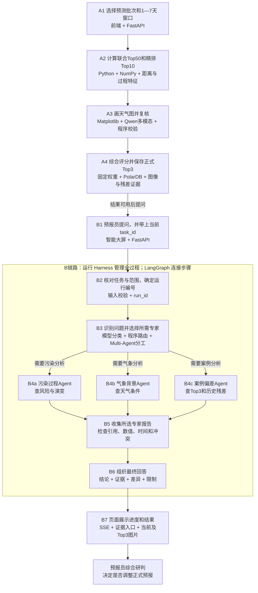
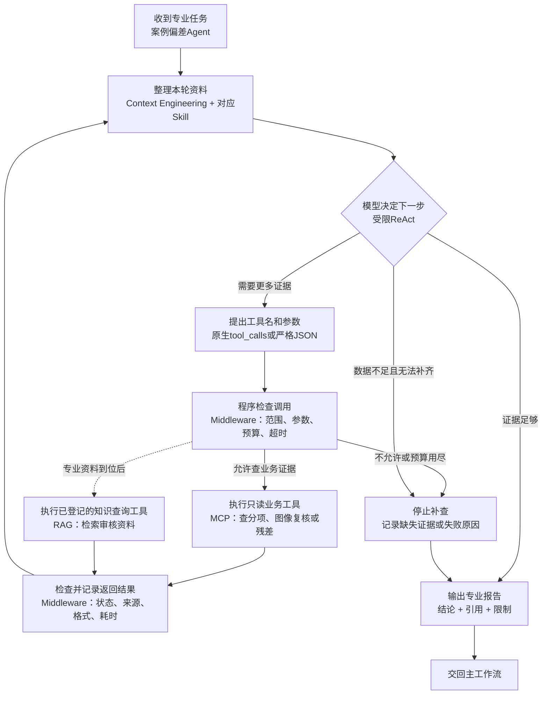
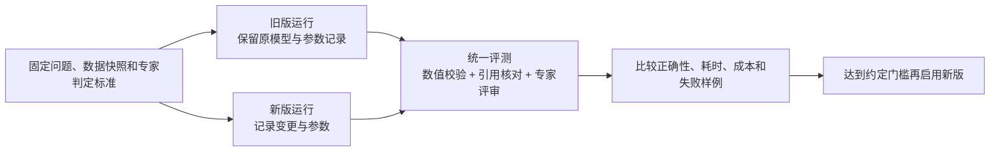

# 相似度匹配智能体升级：概念、流程与面试讲解

> 日期：2026-09-20。对应《智能体技术升级与 Harness 开发方案》。本版用一个业务例子解释技术，适合先理解再准备面试；具体开发契约可查[原方案](智能体技术升级与Harness开发方案.md)。
> 图中的“升级后”是建议开发的目标，不代表已实现。本次新增此文档，不修改代码。项目术语沿用[CONTEXT.md](../CONTEXT.md)。

## 1. 先回答：这些都是 Agent 框架吗？

**不是。它们处在不同层次，可以配合使用。**

把系统想成一个为预报员服务的分析小组：有人看污染，有人看天气，有人查历史；小组有工作流程、有数据查询入口、有专业手册，也有时间限制和质量检查。

| 名称 | 它属于什么 | 大白话 | 对应你的项目 |
|---|---|---|---|
| **Qwen** | 大模型 | 负责理解问题和组织分析的“大脑” | 阅读问题、判断下一步查什么、理解天气图、生成说明 |
| **LangGraph** | 流程编排框架 | 把步骤连起来，并记录当前走到哪里 | 先识别问题，再执行专业分析，最后汇总 |
| **Multi-Agent** | 系统组织方式 | 几个有不同职责的智能体分工 | 污染过程、气象背景、案例偏差分别分析 |
| **ReAct** | 智能体工作方式 | 决定查什么 → 调工具 → 看结果 → 再决定 | 先查Top1分项，发现缺偏差证据，再查历史残差 |
| **运行 Harness** | 执行与管理机制 | 管谁运行、最多查几次、何时停、失败怎么办 | 管理一次问答的状态、并发、权限、预算和取消 |
| **Agent Teams Harness** | 面向多个Agent的运行 Harness | 运行管理之外，还管团队分工和结果收集 | 三个专家能同时分析，某个失败时仍能整理其他结果 |
| **Middleware Chain** | 公共处理链 | 每次调用前后都要走的检查步骤 | 检查工具权限、剩余次数、返回格式，记录耗时 |
| **Context Engineering** | 上下文组织方法 | 给模型准备恰当的资料 | 只给当前任务的必要证据，控制长度，避免混入别的日期 |
| **Skill** | 可复用专业规则 | 一份“这类问题应该怎样分析”的手册 | 气象复核规则、污染过程规则、结果解释规则 |
| **MCP** | 工具连接协议 | 让程序按统一方式调用外部工具 | 用指定工具查任务、候选分项、气象复核证据 |
| **RAG** | 知识检索与回答方法 | 先翻资料，再根据资料回答 | 查询已审核气象/污染物知识，并标明来源 |
| **Evaluation Harness** | 统一评测机制 | 给不同版本做同一套考试 | 比较算法、提示词和Agent改动后的正确性、耗时和成本 |

这里的“框架”指可安装并调用的一套软件。Multi-Agent、ReAct、Context Engineering是设计方法；Harness是一组工程能力，可以自己开发，也可以复用框架提供的部分功能；MCP是协议。它们不是一排相互替代的软件。

**LangChain与LangGraph也要分清：** LangChain提供模型、工具、检索及Agent开发的相关组件；LangGraph重点管理状态和执行流程。使用LangGraph不代表LangChain的所有功能已经接入。原项目的文本切分、真实RAG仍需后续开发。

## 2. 加入之后，一共有几个智能体？

### 2.1 先统一计数方法

本方案把“有明确职责，能在规定工具内决定下一步，保留自己的分析状态，独立提交报告”的专业执行者叫作一个Agent。

| 阶段 | 数量与结构 | 应该怎样讲 |
|---|---|---|
| 当前本地原型 | 一条主工作流，内有三个领域子图，每轮选一个 | “已有工作流式智能体，尚未实现三个专家协作” |
| 本方案第一期目标 | **3个专业Agent＋1条主工作流** | “三名专业Agent由LangGraph流程统一分派和汇总” |
| 后续可选扩展 | 独立增加知识Agent后，共4个专业Agent | 仅接入RAG工具不会自动变成第4个Agent；需单独设置知识角色和运行逻辑 |

**主工作流不另算一个Agent。** 本方案用固定程序规则约束分配和汇总，其中可以调用模型做意图识别或组织文字，但没有另设一个自由行动的“主管Agent”。所以第一期不写成“主管1个＋专家3个＝4个”。这是一种明确的工程划分，不是所有项目通用的命名规定。

### 2.2 三个专业Agent分别做什么？

| 专业Agent | 它负责回答 | 主要查什么 | 交付什么 |
|---|---|---|---|
| **污染过程Agent** | 哪些区域风险较高？何时达到峰值？持续多久？ | 当前预测、区域/站点数据、逐日标签、变化特征 | 污染水平、时间变化与区域差异 |
| **气象背景Agent** | 风、湿度、气压和环流条件怎样影响本次过程？ | 气象数值、已经校验的图像复核、必要专业资料 | 天气背景、相似点、差异和证据限制 |
| **案例偏差Agent** | Top3为什么相似？历史模型偏高还是偏低？ | 正式排名、数值分项、可比历史预测与实况 | 案例解释、历史误差和调整参考 |

三个Agent可以共用同一个Qwen模型。角色不同主要体现在任务、Skill、可用工具和独立上下文不同，**不要求部署三个不同模型，也不等于开三个服务器**。

### 2.3 一次问题会启动几个？

| 用户问题 | 建议执行者 | 本次专业Agent数 |
|---|---|---|
| “查看任务进度”“打开Top2图片” | 普通接口处理；如需自然语言识别，可只调用分类节点 | 0 |
| “为什么Top1排名第一？” | 案例偏差Agent，读取已有数值和图像证据 | 1 |
| “明天污染什么时候加重，与风有什么关系？” | 污染过程Agent＋气象背景Agent | 2 |
| “哪些区域有风险，天气原因是什么，参考历史要不要调整？” | 三个专业Agent共同分析 | 3 |
| “高湿为什么会影响PM2.5？” | 资料就绪后，相关专家调用RAG；也可再设独立知识Agent | 通常1 |

Agent数量、模型调用次数和流程节点数量是三件事。一个Agent查证据时可以多次调用模型；画一个框也不代表新增了一个Agent。多Agent只在问题需要跨领域分析时启用，否则会增加等待和模型费用。

## 3. 先找案例，再解释：业务全流程图

例子：预报员先选择未来3天进行匹配，再问：

> “这3天上海哪些区域有PM2.5风险，天气条件是什么，Top3案例对调整预报有什么参考？”

图中的A链路负责“算出案例”，B链路负责“读证据并解释”。B链路中的专业分析是本次升级重点。已经有匹配结果时，可以直接从提问进入B链路。

**读图注意：** B3只选择需要的专家；B5只等已选专家完成或超时。三个框表示可用的专业角色，不表示每道题都必须运行三个。后台程序校验任务尚未形成正式Top3时，应显示阶段状态或部分结果，不把临时候选当正式排名。

查证据时，三个Agent内部都会使用下一节的循环：**ReAct决定下一步，Skill规定分析方法，Context Engineering准备资料，Middleware做调用检查，MCP连接数据工具。**

### 3.1 每一步为什么需要这些技术？

| 步骤 | 用到的技术或概念 | 为什么用 | 是否属于独立Agent |
|---|---|---|---|
| A1—A2 | FastAPI、NumPy、滑动窗口、标准化与加权距离 | 数值比较需要明确规则和可复核结果 | 否，是计算服务 |
| A3 | Matplotlib、Qwen多模态 | 天气图能补充数值聚合后缺少的空间结构 | 看图模型调用本身不另算一个Agent |
| A4 | 程序合分、PolarDB | 保留排名、图片和分项，便于重复查看 | 否 |
| B2—B7 | 运行Harness | 管状态、总次数、时限、取消和失败 | 否，是管理层 |
| B3 | LangGraph路由、模型分类 | 决定走哪条路径，避免简单问题也启动整个团队 | 否，是主图步骤 |
| B4a—B4c | Multi-Agent＋受限ReAct | 专业任务分开查证据，复杂问题能同时覆盖几个角度 | 是，最多3个专业Agent |
| 专家每次取证或调用模型时 | Context、Skill、Middleware、MCP | 保证资料相关、规则明确、工具调用受控 | 都不单独算Agent |
| B5 | 报告合并与程序校验 | 防止重复、串任务、引用错误和互相覆盖 | 否 |
| B6 | 一次模型汇总或模板生成 | 把已校验结论整理成预报员能读懂的话 | 否，是固定汇总步骤 |
| B7 | SSE | 分析未完成时也能显示进度，完成后展示答案 | 否 |
| 开发/发布时 | Evaluation Harness | 检查新版是否更准确、是否更慢或更贵 | 否，不是用户问答必经的在线步骤 |

## 4. 走进一个Agent：ReAct到底怎么工作？

以案例偏差Agent为例。它收到问题：“Top1为什么相似，能否据此调低明天PM2.5？”

这里ReAct取“推理与行动结合”的意思。**模型提出下一步查证据的动作，真正查询由程序执行。** ReAct不会自动获得数据库权限。

在请求模型作决定或写报告之前，也会检查模型调用预算和上下文长度；图里展开了工具侧检查，模型侧同样受运行Harness管理。

### 4.1 用一次具体查证据过程理解

| 轮次示例 | 模型决定做什么 | 程序实际做什么 | 为什么 |
|---|---|---|---|
| 第1轮 | “先看这个任务是否完成” | 调任务查询工具，返回状态和正式候选 | 未完成任务不能直接当成最终Top3 |
| 第2轮 | “需要Top1的分项依据” | 查污染物、气象数值和已校验图像评分 | 单个总分无法解释为什么相似 |
| 第3轮 | “调整建议需要历史偏差” | 查同类时效、可比模型的历史预测与实况 | 相似度高不代表历史模型一定报高 |
| 第4轮 | “证据够了，生成说明” | 输出带引用的报告；不足则明确缺什么 | 不能无限查，也不能补造数值 |

这是帮助理解的示例路径，不要求每题固定执行四轮。工具若已返回充分证据，可提前结束；同一资料无需反复查询。

“受限”主要是限定可调用工具、次数、时限和结果格式。原方案建议起步值：每专家最多4轮动作，整次问答最多12次工具调用、16次模型请求、90秒。**这些都是待压测参数，跨专家共享总额度，重试和汇总也占额度；不承诺每个专家一定用满预算。** 首次匹配和批量图像复核属于A链路，另设期限。

面试可说：

> “ReAct用于证据查询：模型先判断还缺什么，再选择白名单工具，拿到结果后继续分析。程序限制次数、超时和参数，证据足够或达到边界就结束。数值排名仍由算法计算。”

只记录工具动作、观察结果、简短依据和最终引用即可，不要求模型公开或记录完整内部思维链。

## 5. 为什么还要Harness、中间件和上下文工程？

### 5.1 运行Harness：把一次分析管到底

想象三个专家一起工作：谁开始了、谁还没结束、有没有重复查、费用是否过高、某个专家超时后怎么办，都需要统一处理。这就是运行Harness的工作。

| 它管理什么 | 本项目的例子 |
|---|---|
| 分工与并发 | 问题需要污染和气象时，只启动这两个专家 |
| 共享预算 | 三个专家合计达到工具上限后，不再放行新调用 |
| 运行状态 | 等待、运行中、完成、部分完成、失败、取消、超时 |
| 失败处理 | 气象工具超时，保留污染与案例结论，明确缺少气象判断 |
| 结果收集 | 每个专家交自己的报告，再统一整理，不抢写同一个答案 |
| 运行记录 | 保存问题、任务版本、工具调用、模型/Skill版本、耗时和结果 |

**Checkpoint**是保存图运行状态的“存档点”。有存档不等于程序重启后自动续跑；自动恢复还要有人重新调度、恢复预算并处理重复调用。首期可以先标记中断，让用户重试，再逐步验证恢复能力。

### 5.2 Middleware Chain：把每次调用检查好

运行Harness管理“整件事”，中间件管理“每次具体调用”。例如气象Agent想查一份天气复核结果，中间件依次检查：是不是当前任务的候选、参数是否合法、预算是否够、是否超时；收到结果后检查错误状态、来源与格式，再记录耗时。

这些检查写成可复用的 `before_call / after_call / on_error`处理，避免每个Agent各写一套、各漏一项。中间件不是Agent，也不是必须再安装的一套框架。

### 5.3 Context Engineering：把每次模型要看的材料准备好

上下文就是模型本次能够看到的内容，包括业务规则、问题、工具结果和必要对话历史。

| 做法 | 你的业务例子 |
|---|---|
| 选材料 | 问Top1原因时，先提供Top1必要分项，不塞全库案例 |
| 隔离材料 | 分清今天和上周的任务，分清不同起报批次 |
| 压缩材料 | 用程序计算峰值和持续天数，大数组留在数据库 |
| 保留出处 | 每段证据带任务、日期、空间范围、单位、版本及证据ID |
| 控制长度 | 先保留关键规则和必须证据，再放补充材料，给回答留空间 |

上下文压缩不能丢掉“这个日期缺实况”等关键限制。资料里的文字也不能被当成新指令，要求模型绕过工具限制。

### 5.4 Skill、MCP和RAG分别放在哪里？

拿“风小是否导致这次PM2.5升高”举例：

- **Skill规定怎样分析**：检查风场、湿度、时间对应关系，证据不足时不下定论。
- **MCP连接数据工具**：查询本次实际的气象预测和已校验图像证据。MCP是连接方式，数据查询函数才真正执行取数。
- **RAG提供专业知识**：找审核资料里关于风与污染物扩散的原理，再引用它；一般原理不能单独证明本次成因。
- **Context Engineering组织这些内容**：把规则、当前证据和知识出处放到合适位置，控制长度。
- **模型据此生成回答**，程序继续核对引用和数值。

所以“加了MCP”不会自动有知识库，“加了RAG”不会自动有多个Agent，“加了Skill”也不等于重新训练模型。

RAG内部再分为：**审核资料 → 切成片段 → 转成向量 → 找相关片段 → 重新排序 → 带引用回答**。Embedding把文本转成可比较的数字向量；Reranker进一步判断片段与问题是否相关；LangChain的文本切分器负责切片段，不负责整个RAG。知识查询既可以直接接入程序，也可以封装成MCP工具。

## 6. 算法、多模态和专家分析怎样衔接？

原来最有价值的相似度计算仍然保留。升级是在结果之上增加更完整的业务问答。

| 环节 | 负责什么 | 关键边界 |
|---|---|---|
| 纯数值第一版 | 污染物与气象数值序列、均值粗筛、逐日差分、距离归一化 | 第一版已有气象数值，但没有空间场图像复核 |
| 当前第二版方案 | 逐日标签、九宫格、联合Top50、精排Top10、气象图像复核 | 日窗口等长、日序对齐；历史候选按既定数据口径构造 |
| Matplotlib | 把气象网格按统一范围和色标画成图 | 图片由程序绘制，Qwen读取图片进行判断 |
| Qwen多模态 | 比较温度、湿度、气压与风、500 hPa环流结构 | 模型给分项和依据，程序校验身份、日序、分数和证据 |
| 程序最终合分 | 污染物60%＋气象数值20%＋气象图像20% | Agent无权自行更改权重或重排正式Top3 |
| 新增专家分析 | 根据已保存结果补查证据、解释风险及历史误差 | 优先复用已有复核，避免每问一句都重新跑匹配和看图 |

查看天气图片时，前端通过哈希调用图片接口，后端返回数据库中的PNG字节。**气象Agent只拿到哈希不等于看到了图。** 它要么读取已校验的复核文字，要么经支持视觉输入的专用通道接收实际图片。

历史残差在本项目中是“历史实况−历史预测”。例如历史实况比预测低，只说明当时存在报高现象；要把这个误差用于当前参考，还要核对模型版本、区域、污染物和预报时效。缺少可比数据时不生成定量调整，最后由预报员决定。

## 7. Evaluation Harness：怎样检查改版有没有用？

评测Harness是开发和发布用的“考试系统”，不会作为另一个Agent加入每次用户问答。

| 检查层 | 怎样检查 | 能证明什么 |
|---|---|---|
| 算法回归 | 固定算例，比较预期分数和排名 | 数值计算和边界处理没有改错 |
| Agent程序测试 | 模拟工具返回、超时、非法动作、专家失败 | 调度、预算、状态合并和异常处理正确 |
| 真实模型评测 | 固定业务问题和数据，调用真实模型，专家检查 | 工具选择与最终业务回答是否合格 |

重点记录：Top3命中情况、回答事实是否正确、引用是否支持结论、缺证是否说明、耗时及调用成本。初始样本应覆盖五类业务问题，也要包含单日/多日、候选不足、缺实况、图像不可用等失败场景。

**相似度分数变高不等于效果变好。** 模型给了90分，只代表它判断两个案例相似；93%的Hit@3则应按“前三至少一个案例被专家认可的任务数÷抽样任务总数”计算，两者不是同一指标。91%的知识问答正确率也需要对应问题集和专家标准。

比较版本时按独立污染事件或时间划分样本，避免相邻重叠窗口同时进入调参集和测试集。工具录制回放、模拟模型测试和真实模型评测分别报告；不能拿模拟测试通过证明真实模型的业务准确率。

## 8. 怎样开发？先做哪一步？

### 8.1 当前有的与需要增加的

根据原方案2026-09-20的仓库核查，远端与本地HEAD均为 `25bc3f4`，LangGraph、MCP等部分升级仍在本地未提交区域。本版沿用该核查基线，未重新连接GitHub。

| 当前本地已有 | 还要开发 |
|---|---|
| 单领域路由，子图固定取证再分析 | 让专家选择工具并观察结果的受限ReAct循环 |
| 三个专业Skill与六个只读MCP工具 | 更完整的区域、时序、气象与残差证据 |
| 模型文本请求与匹配图像复核 | 模型tool_calls或受校验JSON动作协议 |
| Checkpoint、SSE及部分异常处理 | 运行预算、取消、并发、事件恢复等统一Harness |
| 单元测试及Skill样例 | 统一数据集、执行器、版本对比和真实模型评测 |
| 空RAG接口 | 专业资料审核、切分、检索、重排与引用回答 |

代码有三个领域子图，并不代表证据已经足够。行政区污染风险需要站点到行政区的明确映射；日数据不能回答小时级峰值；当前六个工具也不等于已经覆盖全部业务。

### 8.2 推荐顺序与验收

| 阶段 | 做什么 | 谁主要负责 | 怎样判断完成 |
|---|---|---|---|
| 0. 保存基线 | 审查本地改动，固定旧版算例和契约 | 负责人＋开发成员 | 旧版能够复现，已有代码不会被覆盖 |
| 1. 把资料查全、运行管好 | 补证据工具、运行编号、预算、状态、中间件和上下文 | 数据后端＋Agent开发 | 五类问题明确哪些可答；缺资料会正确说明 |
| 2. 先让一个专家会补查 | 开发受限ReAct，校验工具名、参数和停止条件 | Agent开发 | 不越权、不无限循环，能形成有引用报告 |
| 3. 让多个专家协作 | 按问题选1—3个专家，独立报告，统一汇总 | Agent后端＋前端 | 并行不覆盖结果；一个失败不伪装全部成功 |
| 4. 评测后启用 | 运行统一评测集，对比正确性、耗时和成本 | 算法负责人＋测试＋业务专家 | 算法回归通过，关键反例通过，达到约定门槛 |
| 5. 资料到位后接RAG | 审核、分块、检索、重排、引用；可增知识Agent | 知识库开发＋业务专家 | 知识回答可追溯，无资料时不伪造引用 |

评测样例从阶段0就开始建设，阶段4做集中评测和发布决策。简单问题默认保持单分支，复杂问题逐步开启多Agent；效果或成本不达标可以关回原路径。

项目负责人需要把关：业务要回答什么、数据口径是否一致、成员分工和接口依赖、需求变更优先级、专家验收标准及发布时点。技术升级应对应实际交付，而不只是增添术语。

## 9. 开发细节速查：不背源码也能理解

### 9.1 主要模块怎么改？

下表新增的名字属于设计，尚不是已完成代码。

| 文件或模块 | 简单职责 | 函数/API示例 |
|---|---|---|
| `backend/agent/graph.py` | 连接步骤，选择专家、循环和汇总 | `StateGraph`、`add_node`、`add_conditional_edges`、`compile` |
| `backend/agent/model_client.py` | 把模型输出转成受控动作 | 拟增 `decide_action`；解析 `tool_calls`并对应 `tool_call_id` |
| `backend/agent/contracts.py` | 规定证据和报告长什么样 | `EvidenceItem`、`SpecialistReport`；用Pydantic校验 |
| 拟增 `harness.py` | 管一次分析的开始、结束、预算和并发 | `AgentRunManager`；每次分析使用唯一run_id |
| 拟增 `middleware.py` | 把调用前后检查抽成公共处理 | `before_call / after_call / on_error` |
| 拟增 `context.py` | 选取和整理模型所需证据 | 按任务、日期、领域、版本过滤并控制长度 |
| `mcp_gateway.py`与`mcp_server/` | 连接并执行受限数据工具 | `ClientSession.call_tool`、服务端`@mcp.tool` |
| `backend/agent/knowledge.py` | 接入专业资料查询 | `search`现为空接口；后续可用`split_documents`等准备知识片段 |
| 拟增 `evals/` | 存题目、评测执行器和评分规则 | 固定数据集版本，生成逐题及版本对比结果 |

多个专家并行时，各自保存状态和报告。最简单的实现是程序收集所有报告后一次写回主图；若使用LangGraph并行分支直接更新状态，就要设置合并规则（reducer）。reducer解决“多个结果怎样合起来”，不负责判断哪个专家的结论更正确。

### 9.2 接口与编号

| 编号/接口 | 意思 |
|---|---|
| `task_id` | 一次相似度匹配的编号：你在分析哪份Top3结果 |
| `conversation_id` | 一段对话的编号：哪些追问属于同一对话 |
| `run_id` | 一次问答运行的编号：这次调用花了多久、哪些专家完成了 |
| 拟增 `POST /api/agent/runs` | 开始一次问答，返回run_id；接受请求不代表回答已完成 |
| 拟增 `GET /api/agent/runs/{run_id}` | 查询状态和最终答案 |
| 拟增 `GET /api/agent/runs/{run_id}/events` | 用SSE持续传进度与结果 |
| 拟增 `POST /api/agent/runs/{run_id}/cancel` | 请求停止这次问答，不删除已有匹配结果 |

SSE可以理解为浏览器开着一条接收通道，服务器有进度就发过来；它不天然保证模型逐字输出或断线重放。断线续接需服务端保存有序事件，重连后补发，客户端去重。旧的问答接口保留兼容。

### 9.3 存储和失败处理

新增扩展表保存一次运行、过程事件、工具调用和评测结果；原始图与业务数据仍留原表，记录引用。重复发起同一个请求要用请求ID避免创建多个运行；同一工具、参数和数据版本可复用结果。图像缓存、模型复核缓存和请求幂等解决的是不同问题。

工具查询只读，也要核对任务访问范围；MCP的“只读”标记本身不等于真正权限控制。工具错误要作为错误处理，不能被塞成有效证据。参数不合法不盲目重试；网络瞬时失败可在总预算内有限重试。

取消协程不保证后台数据库线程立即停止，所以数据库还要设置语句超时。程序重启的恢复、断线事件重放、取消、持久化工作任务都要单独验收，不能只凭“用了LangGraph和SSE”就认为已经具备。

模型名称可以配置；是否支持图片和工具调用分别实测，不能根据名称猜测。专业知识文件、数据中台正式契约和评测样本未齐时，保留接口及明确限制。

## 10. 面试怎么解释？

### 10.1 一段能完整讲清的回答

> “我的方案把相似度计算和智能体解释分开。Python算法先选出Top3，保留数值和图像证据；LangGraph再按用户问题分配污染、气象和案例偏差三个专业角色。简单问题只运行一个，复杂问题才协作。每个角色用受限ReAct按需补查证据，Skill规范分析方法，MCP连接只读业务工具，Context Engineering负责把当前任务的有效材料交给模型。运行Harness管理并发、预算和失败，中间件负责每次调用前后的校验；评测Harness用固定样例与专家标准比较不同版本。最终输出有依据的参考，正式预报由预报员决定。”

这段是**目标设计的讲法**。实施完成后才能改成“已经实现”，并给出对应代码、调用记录和评测结果。

### 10.2 常见追问与短答

| 面试官追问 | 可以怎样回答 |
|---|---|
| 这些都是框架吗？ | LangGraph是编排框架；Multi-Agent是组织方式，ReAct是行动循环，Harness是运行或评测机制，MCP是协议。 |
| 你用了几个Agent？ | 目标一期有3个专业Agent，由1条主工作流管理；每题按需运行0—3个。知识角色独立接入后才增加到4个。 |
| 为什么汇总节点不算第四个Agent？ | 本方案把它设为固定的报告整理步骤，没有独立工具循环；调用一次模型不自动等于一个Agent。 |
| 为什么三个子图不直接叫多Agent？ | 子图只是代码组织结构；要有独立任务、状态、受限行动及报告协作，才形成本方案的专业Agent团队。 |
| 三个Agent必须用三种模型吗？ | 不需要，可以共用模型，靠不同任务、Skill、工具范围和上下文区分角色。 |
| ReAct和普通固定流程有什么区别？ | 固定流程预先决定查什么；受限ReAct由模型根据观察选择下一步，程序控制能查什么和何时停止。 |
| 为什么不全让模型做？ | 数值距离、排名和窗口对齐需要程序核验，模型负责取证选择、图像判断和解释。 |
| Harness与LangGraph有什么区别？ | LangGraph提供图和状态执行能力；运行Harness还需要预算、权限、并发、失败策略与轨迹等整套管理。 |
| 运行Harness和评测Harness有什么区别？ | 前者让这次任务受控完成；后者检查系统不同版本完成得好不好。 |
| Middleware与Harness是不是重复？ | Harness管理整次运行，中间件把管理规则落实到每次模型/工具调用。 |
| Context Engineering就是写提示词吗？ | 提示词只是其中一部分，还要选择工具证据、隔离任务、压缩历史、保留引用并控制长度。 |
| MCP和RAG怎样区分？ | MCP连接工具，RAG检索知识并辅助回答；RAG可封装成MCP工具，两者可以配合。 |
| 为什么只拿图片哈希不能解释天气？ | 哈希用于定位图片，不包含模型可理解的天气内容；要提供实际图像或已校验视觉证据。 |
| 多Agent一定更好吗？ | 不一定，要与单专家基线比较质量、耗时和成本，复杂问题有收益才启用。 |
| 怎么证明93%和91%？ | 给出抽样任务/题目数量、专家判定口径和原始结果；不把相似度分数或模拟测试当准确率。 |

## 11. 阅读与实施入口

先理解第1—5节的概念和两条业务链路，再用第7节判断效果，用第8—9节安排开发，第10节准备面试。

- [完整开发方案：模块、契约、预算和发布门槛](智能体技术升级与Harness开发方案.md)
- [面试技术说明：现有算法和函数细节](面试技术说明.md)
- [现有主图与子图源码](../backend/agent/graph.py)
- [模型请求源码](../backend/agent/model_client.py)
- [MCP工具源码](../mcp_server/tools.py)

本文解释目标方案与已有代码的差异。理解术语之后，按阶段实现并留验收证据，才形成可以在简历和面试里具体展开的技术经历。
