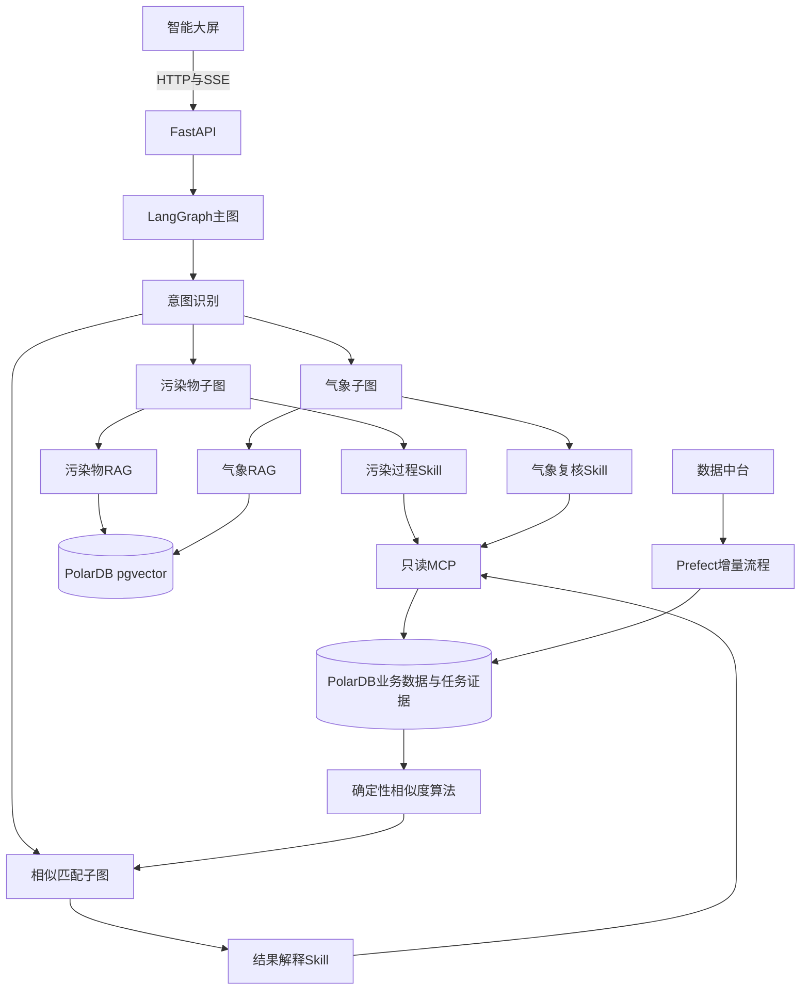
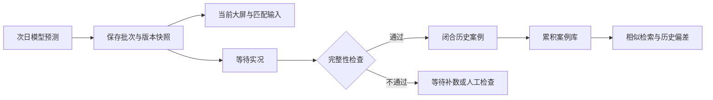

# 空气质量预报智能体架构

## 1. 建设目标

目标系统接收数据中台提供的次日污染物和气象预测，以持续累积的历史污染案例为检索范围，寻找污染变化和天气背景最相似的过程。系统向预报员提供Top3案例、形成原因和历史偏差参考，不自动修改正式预报值。当前代码仍使用2025固定数据联调，真实持续增量要在数据中台契约确认后启用。

智能大屏是统一入口，展示污染物站点数据、气象网格数据和相似匹配结果。产品大屏尚在设计时，本项目先提供稳定的HTTP、SSE和MCP接口。

## 2. 总体架构

## 3. 责任边界

| 组件 | 负责 | 不负责 |
|---|---|---|
| 相似度算法 | 候选检索、数值精排、最终加权与排名 | 自由生成业务结论 |
| LangGraph | 意图识别、调用子图、组织证据、生成说明 | 修改算法权重或正式预报 |
| Skill | 固化污染物、气象和结果解释步骤 | 保存业务数据 |
| MCP | 提供受限、只读、结构化业务证据 | 任意SQL和写入业务表 |
| RAG | 检索已审核的专业知识并返回引用 | 保存当前预测数值或任务结果 |
| Prefect | 定时增量拉取、校验、重试和补数 | 猜测尚未确认的数据中台字段 |
| 预报员 | 结合多个数值模型和经验作最终判断 | 被系统自动替代 |

## 4. LangGraph设计

主图先识别系统操作或五类业务问题，再路由至三个领域子图。

| 意图 | 示例 | 路由 |
|---|---|---|
| pollution_risk | 今天哪些区域可能有PM2.5污染？ | 污染物子图 |
| temporal_evolution | 什么时候达到峰值？ | 污染物子图 |
| cause_analysis | 浦东臭氧偏高可能是什么原因？ | 气象子图 |
| historical_adjustment | 哪些历史过程最像，预测可能偏高吗？ | 相似匹配子图 |
| professional_knowledge | 高湿为什么促进颗粒物累积？ | 按专业词路由污染物或气象子图 |
| system_operation | 创建任务、查看进度或匹配结果 | 相似匹配子图 |
| unknown | 信息不足或超出范围 | 说明支持范围 |

共享状态包含问题、任务ID、会话ID、意图、路由、Skill名称、证据和回答。`conversation_id`作为Checkpoint的`thread_id`；配置PolarDB Checkpoint后，服务可以从已保存状态继续执行。

智能体可以识别创建任务的请求，但首版只读MCP不执行创建操作；大屏继续通过现有`POST /api/tasks`显式创建任务，智能体只提供入口引导和结果解释。

## 5. MCP工具

`similarity_match_mcp`通过内网Streamable HTTP提供以下只读工具：

| 工具 | 用途 |
|---|---|
| similarity_list_forecast_batches | 分页查询预测批次 |
| similarity_get_task_result | 查询任务状态、权重和Top3摘要 |
| similarity_search_historical_candidates | 分页查询历史候选 |
| similarity_get_candidate_metrics | 查询指定候选分项证据 |
| similarity_get_weather_images | 查询当前窗口和Top3图片引用 |
| similarity_get_review_evidence | 查询已校验的模型复核证据 |

MCP不提供任意SQL、图片字节、密钥、任务创建或正式预报修改能力。

## 6. 数据生命周期

业务服务器保留权威数据，本项目保存复现匹配所需的批次、版本、不可变快照、特征和引用。不同模型版本可以参与相似案例检索；定量偏差建议优先使用相同版本或经过可比性验证的版本。历史气象比较最终采用归档预测、实况还是再分析场，需由数据中台契约和业务验收确认；当前文档不预设该口径。

## 7. RAG骨架

RAG分为污染物和气象两个知识空间。只有`PUBLISHED`文档可以检索，每个分块保留资料名称、版本和页码或章节定位。主推理模型默认配置为`qwen3.8-32b`；Embedding和Reranker使用独立配置，待真实资料到位后通过评测确定。

当前数据库已提供但尚未安装`vector`扩展。`backend/knowledge_schema.sql`只作为人工执行的建表脚本，不在应用启动时自动修改数据库。

## 8. 部署与观测

Docker Compose提供前端、API、MCP、Prefect、Prometheus和Grafana。核心服务默认启动；Prefect和监控通过Compose profile按需启动。业务数据、模型调用和追踪信息不发送到外部观测平台。

第一期LangGraph随API进程运行；接口稳定且任务量明确后，再把Agent执行拆到独立Worker。这个阶段性安排避免在没有真实并发数据前引入额外消息队列。

## 9. 当前实现状态

- 已有：2025固定数据上的相似度检索、Top3/Top1、四类气象图、Qwen图像复核、任务证据和原始历史残差保存。
- 本期骨架：LangGraph路由、三个Skill、SSE、只读MCP、Prefect模拟流、RAG接口、Docker和内网指标。
- 待外部输入：数据中台正式接口与历史气象口径、专业知识文件、产品经理的大屏设计、Embedding与Reranker评测结果。结构化定量调整建议和反馈闭环在后续阶段完成。
